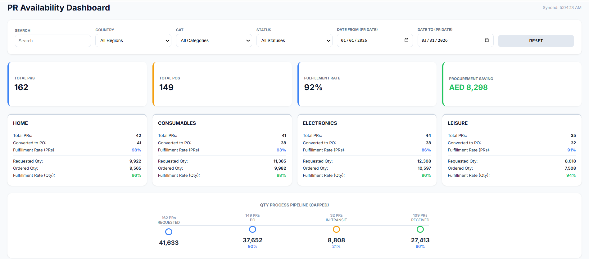
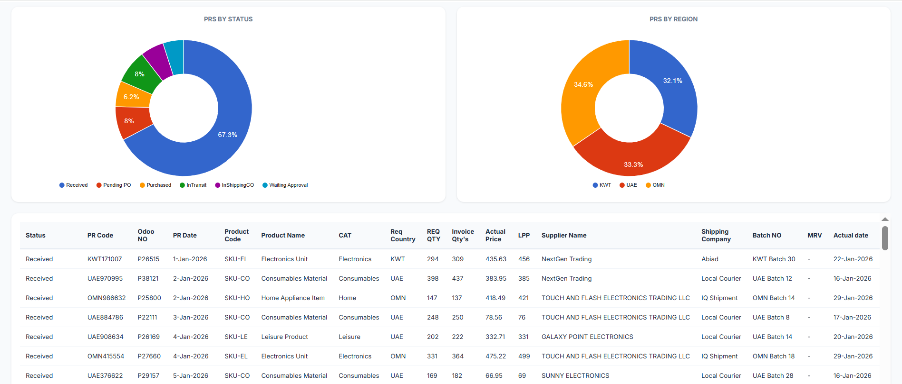

# 📊 Automated Procurement Dashboard (UAE, Kuwait, Oman)

## 📌 Overview
This project demonstrates how I transformed a manual, spreadsheet-based reporting process into a fully automated data pipeline and interactive dashboard to improve visibility and performance tracking across multiple countries.

> ⚠️ Note: Data is simulated due to confidentiality.

---

## 🎯 Objectives
- Improve visibility of procurement performance  
- Eliminate manual reporting effort  
- Build an automated, real-time dashboard  
- Enable faster and more informed decision-making  

---

## 🚧 Challenges
- Data stored in large Google Sheets updated daily  
- No BI tools available
- Source data could not be modified (single source of truth)  
- Manual reporting was time-consuming and inefficient  

---

## 🧠 Solution Architecture

### 1. Data Extraction Layer
- Created a separate Google Sheet to avoid impacting the main data source  
- Used JavaScript (Google Apps Script) to extract only relevant data  
- Ensured clean and structured data for reporting  

---

### 2. Data Automation
- Implemented automated triggers to refresh data every 15 minutes  
- Eliminated need for manual updates  
- Ensured near real-time data availability  

---

### 3. Backend Processing
- Built `Code.gs` functions to serve processed data  
- Enabled dynamic data retrieval for dashboard consumption  

---

### 4. Frontend Dashboard (HTML + JS)
- Developed a custom dashboard using HTML & JavaScript  
- Integrated with Apps Script backend  
- Visualized key procurement metrics in a clean UI  

---

## 📊 Key Features

- 🔄 Automated data refresh (every 15 minutes)  
- 📦 Procurement performance tracking across 3 countries  
- 📈 Real-time visibility of key metrics  
- ⚡ Eliminated manual reporting   

---

## 📊 Dashboard Preview

### 📦 PR Availability

### 🚚 Delivery Performance (On-Time vs Delayed)

### 🤝 Supplier Performance

--
-
## 📈 Business Impact

- ⏱ Reduced manual reporting effort significantly  
- 👀 Improved visibility across UAE, Kuwait, and Oman  
- ⚡ Enabled faster decision-making for management  
- 🔁 Created scalable and reusable reporting solution  

---

## 🛠 Tools & Technologies
- Google Sheets  
- Google Apps Script (JavaScript)  
- HTML / JavaScript  

---

## 💻 Code Structure

- `scripts/code.gs` → Backend logic (Google Apps Script)  
- `frontend/index.html` → Dashboard UI & visualization  

The system uses Apps Script as a lightweight backend to serve data dynamically to the frontend dashboard.

---

## 🔗 How It Works

1. Data is pulled from the main sheet → into a clean reporting sheet  
2. Trigger updates data automatically every 15 minutes  
3. Apps Script serves the data  
4. HTML dashboard fetches and visualizes the data  

---

## 💡 Key Takeaway
Even without traditional BI tools, it's possible to build powerful, automated, and scalable data solutions using lightweight tools like Google Sheets and Apps Script.

---

## 🔗 Live Dashboard
👉 [View Live Dashboard](https://script.google.com/macros/s/AKfycbzJSCrZtdrTym1QItygZG5DrC6fid8UDswReQwAAfOXeABWhEvKDOY-tjYR5tVOboHe9A/exec)

> Fully automated dashboard powered by Google Apps Script, refreshing data every 15 minutes.
